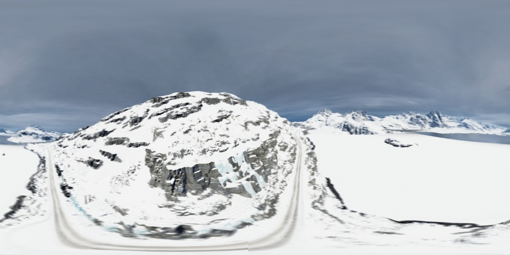
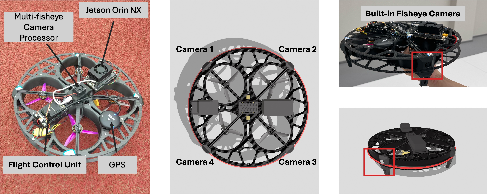
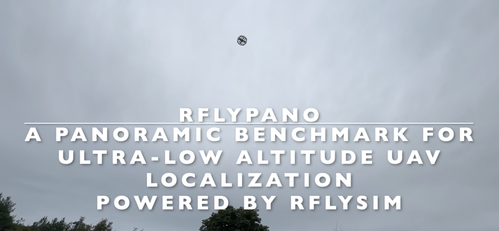

# RflyPano: A Panoramic Benchmark for Ultra-low Altitude UAV Localization Powered by RflySim


## 📰 News
- **[2025-11]** 🎉 Our paper has been **accepted at AAAI 2026 Main Technical Track**!  [**[Paper]**](assets/RflyPano_AAAI_CameraReady.pdf)
- **[2025-11]** 📦 The **full synthetic dataset** is now available.

This repository provides:

- Panoramic datasets and fisheye datasets for UAV global localization.
- A Python script to stitch four fisheye camera images into a seamless panoramic image based on polynomial fisheye distortion modeling and equirectangular projection from RflySim.
- Scripts to collect fisheye datasets from RflySim.

The dataset and images are generated from a virtual environment using **RflySim (version 3.07 full edition)**.

📘 You can find detailed documentation for RflySim at:  
👉 https://rflysim.com/doc/en/

Below is an example of the stitched panoramic image from four fisheye inputs:



Feel free to explore and have fun!

## 📦 Dataset Download

The full RflyPano dataset is available here:

- 📥 **Dropbox (Full Dataset)**: [Download Link](https://www.dropbox.com/scl/fo/fk9hgzky3zle1w06c7dsm/AGPttdydTaejjFQ3C9c8bMU?rlkey=zmhx6hno0zcqy5b4bbbtpjpk2&st=wle550q7&dl=0)


## 📁 Dataset Structure

The dataset is organized hierarchically and consists of two main folders:

---

### 🔹 `FisheyeView/sceneXX/seqXX/` – Input fisheye images and extrinsics

🕜🔹 `img_0_<timestamp>.jpg`   — Front-Right camera  
🕜🔹 `img_1_<timestamp>.jpg`   — Rear-Right camera  
🕜🔹 `img_2_<timestamp>.jpg`   — Rear-Left camera  
🕜🔹 `img_3_<timestamp>.jpg`   — Front-Left camera  
🕜📄 `label_<timestamp>.txt`   — Extrinsic parameters for this timestamp (e.g., relative camera poses)

Each `seqXX` contains multiple image groups. A valid group consists of:
- Four images with the same `<timestamp>`
- One `label_<timestamp>.txt` describing extrinsics

Details can be found [here](./PanoramaDataset/readme.md)

---

### 🔹 `PanoramaView/sceneXX/seqXX/` – Output panoramic image and calibration info

🕜🔹 `panorama_<timestamp>.jpg` — Stitched panoramic image for one timestamp  
🕜📄 `cam_infos.txt` — Camera parameters and poses for all four cameras in this scene

The file `cam_infos.txt` includes 4 lines (one per camera, `i = 0 to 3`), each with the following format:

mapping_coeffs_i (4), ImageSize_i (2), DistortionCenter_i (2), StretchMatrix_i (4), roll_i, pitch_i, yaw_i (degrees), tx_i, ty_i, tz_i (meters)


This describes both the **intrinsic** and **extrinsic** calibration of each fisheye camera:

- `mapping_coeffs`: Polynomial coefficients of the fisheye projection model
- `ImageSize`: Image resolution (width, height)
- `DistortionCenter`: Optical center of the fisheye image
- `StretchMatrix`: Calibration scaling (typically 2x2 matrix, stored row-wise)
- `roll/pitch/yaw`: Orientation of the camera relative to the UAV body frame (in degrees)
- `tx/ty/tz`: Translation of the camera in meters (also relative to UAV body frame)

> 🧭 These parameters ensure accurate projection and spatial alignment during panoramic stitching.

---


### 📌 File Naming Convention

img_<camera_id><timestamp>.jpg label<timestamp>.txt panorama_<timestamp>.jpg


- `camera_id`: 0 = front-right, 1 = rear-right, 2 = rear-left, 3 = front-left  
- `timestamp`: Floating-point number with up to 6 decimal places (e.g., `1713947554.840796`)

> The script will recursively process all `sceneXX/seqXX/` folders and output the results with matching structure and filenames.


📜 Files

`fisheye_to_panorama.py` – Main script for stitching four fisheye images into a panoramic image

`fisheye_intrinsics.txt` – Intrinsic parameters of the fisheye camera in polynomial form

`PanoramaDataset` - Folder containing scripts for dataset collection. Details can be found [here](./PanoramaDataset/readme.md)

🔧 Camera Model

The fisheye model used is based on a 4th-degree polynomial mapping from viewing angle (theta) to image radius:

$r(\theta) = k_0 \theta + k_1 \theta^3 + k_2 \theta^5 + k_3 \theta^7$

🚀 Usage

Run the script:

`python fisheye_to_panorama.py --input_dir FisheyeView --output_dir PanoramaView`

The script will automatically:

Group fisheye images by timestamp

Perform angular reprojection and undistortion

Generate and save panoramic images

📌 Notes

Ensure each timestamp has exactly four images and follow the naming conventions, one from each direction.

The script supports batch processing and robust interpolation.

You can adjust panorama resolution via the `--pano_size parameter` in the script.

📦 A small demo dataset is available for downloading via Google Drive:

👉 [Download demo panorama dataset (Google Drive)](https://drive.google.com/file/d/1tduZfmEj0t1jUEV401Rd64Ank1QgVlm-/view?usp=sharing)

👉 [Download demo fisheye dataset (Google Drive)](https://drive.google.com/file/d/1mcBSOLBNlwCNWw0UPQaiEn11kdygkzYD/view?usp=sharing)


This demo includes:
- Raw fisheye images from four virtual cameras (`FisheyeView/sceneXX/seqXX/`)
- Corresponding extrinsic parameters (`label_<timestamp>.txt`)
- Precomputed panoramic images (`PanoramaView/sceneXX/seqXX/`)
- Camera configuration info for each sequence (`cam_infos.txt`)

You can use this dataset to directly test the stitching script or to verify results with the pre-generated panoramas.

## 🚩 Custom Panorama UAV for Sim-to-Real  


To evaluate the sim-to-real gap, we collect real-world panoramic images using a fully custom ultra-low-altitude UAV equipped with four fisheye cameras.  
The hardware platform is continuously optimized to reduce the gap between simulation and reality.  
Further expansion and the final release of real-world data are in progress.


  

Main onboard modules:  
- **Jetson Orin NX** – onboard algorithm computing.  
- **Multi-fisheye Camera Processor** – processes inputs from four synchronized fisheye cameras.  
- **Flight Control Unit (FCU) with GPS** – provides navigation and localization.  
- **Four Fisheye Cameras** – mounted around the UAV to achieve panoramic vision consistent with the proposed configuration.

🎥 Watch our real-flight demo:  
[](https://www.youtube.com/watch?v=SE8qwFe-EA0)  
*(click to watch on YouTube)*

## ⚠️  Acknowledgements
1. Scene001 ~ Scene003 of the dataset are default scenes in RflySim.
2. Other scenes are downloaded and cooked from [FAB](https://www.fab.com/zh-cn).

## 📝 Citation
If you find our work or dataset useful, please cite our AAAI 2026 paper:

```bibtex
@inproceedings{2026rflypano,
  author    = {Dai, Dun and Lu, Ze and Dai, Xunhua and Quan, Quan},
  title     = {RflyPano: A Panoramic Benchmark for Ultra-low Altitude UAV Localization},
  booktitle = {Proceedings of the AAAI Conference on Artificial Intelligence},
  volume    = {40},
  number    = {22},
  pages     = {18216--18224},
  year      = {2026},
  month     = {Mar.},
  doi       = {10.1609/aaai.v40i22.38884},
  url       = {[https://ojs.aaai.org/index.php/AAAI/article/view/38884](https://ojs.aaai.org/index.php/AAAI/article/view/38884)}
}


